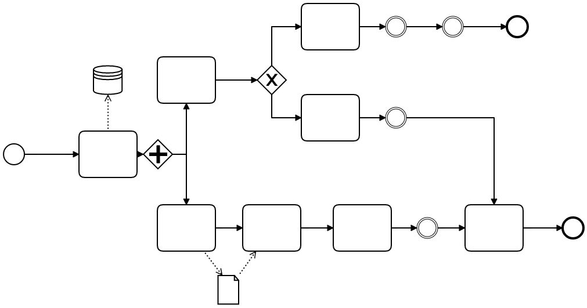
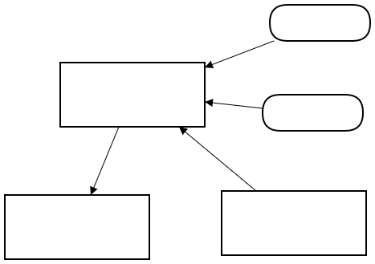
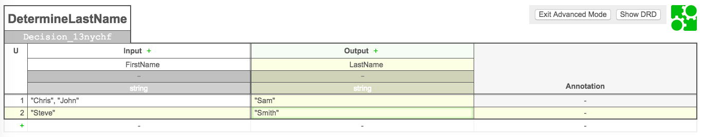
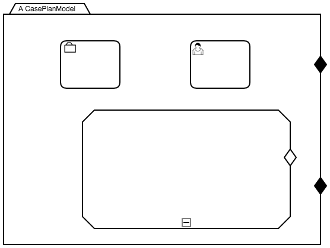

# Project Overview Title

# Overview

*This is the overview explanation of the process project. Explain the purpose of the project.*

# Files

*Explain what is the purpose of each process and process related file in the project.*

## pay_taxes.bpmn

This file does something and its purpose is to do abc.

## myDecision.dmn

This file does something and its purpose is to do abc.

1. DDR
1. DMN

## myCasePattern.cmmn

This file does something and its purpose is to do abc.

## myScripts.js

This file does something and its purpose is to do abc.

## myEmailTemplate.ftl

This file does something and its purpose is to do abc.

Image example of the Rendered Freemarker file (if applicable)

# How to Deploy

Explanation of how to deploy this specific project goes here.

*For further deployment options and templates see: [Deployment Documentation]](docs/deployment.md)*

# Change Log

*Store details about the releases of your project in the Change Log*
[Project Change Log](CHANGELOG.md)

# Other Information

*Explanation of other details about the project that may not have been included in the Overview.*

Examples:

1. Use cases.
1. Error handling.
1. If there is re-usable code that could be used for other purposes.
1. Explanation of any specific configurations, in-line code or expressions in any of the process files.
1. Project Contact information/Persons Responsible.
1. Explanation of designs and specific configurations.
1. Related documentation that may be contained in another system or the `/docs` folder.
